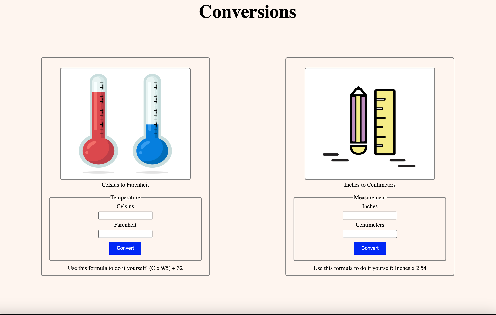

# Conversions

This repo contains a simple web-based application that allows users to convert temperatures from Celsius to Farenheit and measurements from inches to centimeters.  
Please note that the conversion functionality is not implemented yet as the project currently lacks JavaScript integration, meaning the buttons do not perform any actions yet.
This is purely to show html and css files working together. 

## Features
- Interface only: Provides interface for entering temperatures in Celsius to be converted to Farenheit
- Interface only: Provides an interface for entering measurements in inches to be converted to centimeters.

## Technologies
- HTML5
- CSS3

## Setup
To run this project, download or clone the repo and open the index.html file in a browser to view the conversion interface.

## Visual

